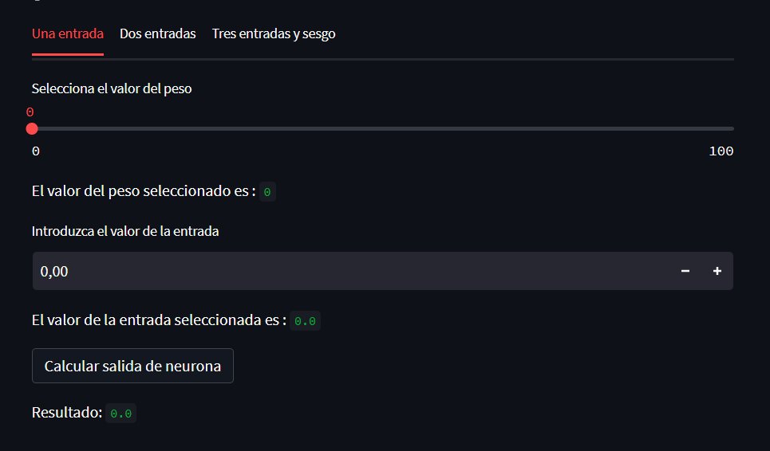
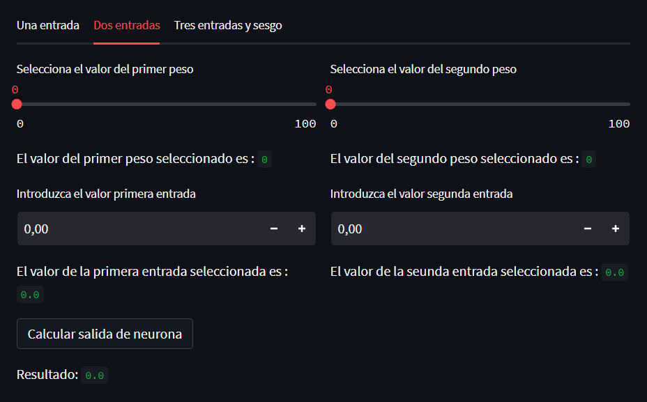
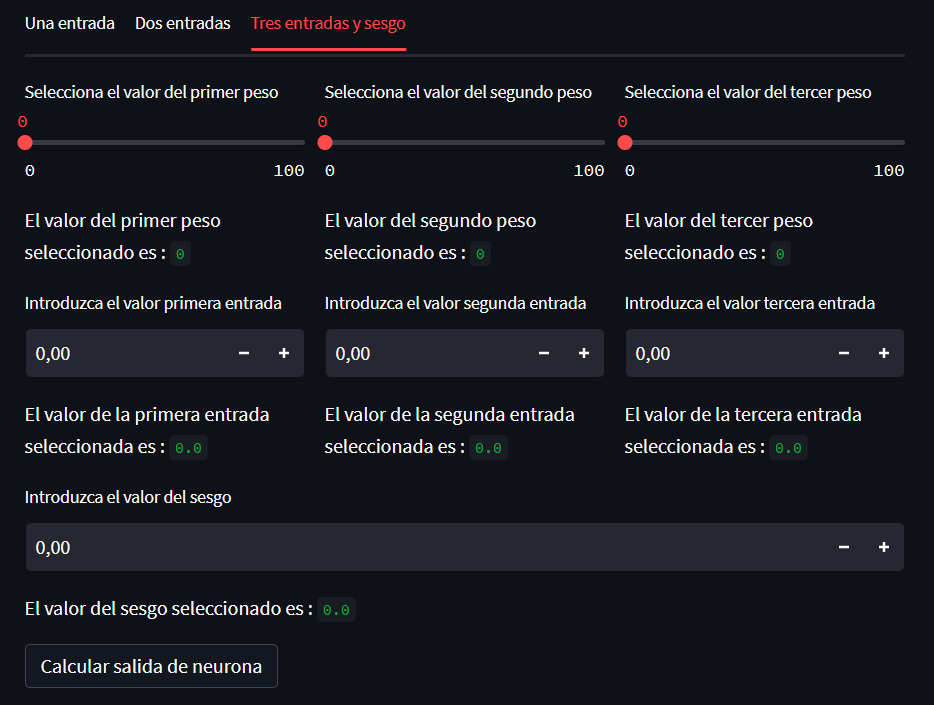

# [Hola Neurona 🧠](https://jaimesalado-hola-neurona-app-p9pyzp.streamlit.app/ "Hola Neurona 🧠")

Web streamlit con python. Donde podemos calcular el valor de salida de : 

- Una neurona con un valor de entrada y un peso. 
 
 `peso * entrada`
 
- Una neurona con dos valores de entrada y dos pesos.
   `(entrada1 * peso1) + (entrada2 * peso2)`

- Una neurona con tres entradas,tres pesos y un sesgo.

  
`(entrada1 * peso1) + (entrada2 * peso2) + (entrada3 * peso3) + sesgo`

