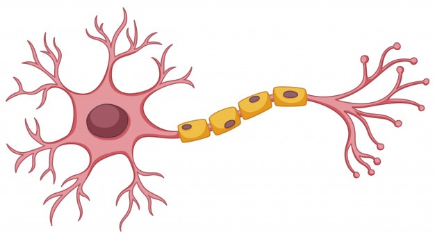

# [Hola Neurona 🧠](https://jaimesalado-hola-neurona-app-p9pyzp.streamlit.app/ "Hola Neurona 🧠")

Web streamlit con python. Donde podemos calcular el valor de salida de : 

- Una neurona con un valor de entrada y un peso.
- Una neurona con dos valores de entrada y dos pesos.
- Una neurona con tres entradas,tres pesos y un sesgo.

 

 

`$ peso * entrada`
